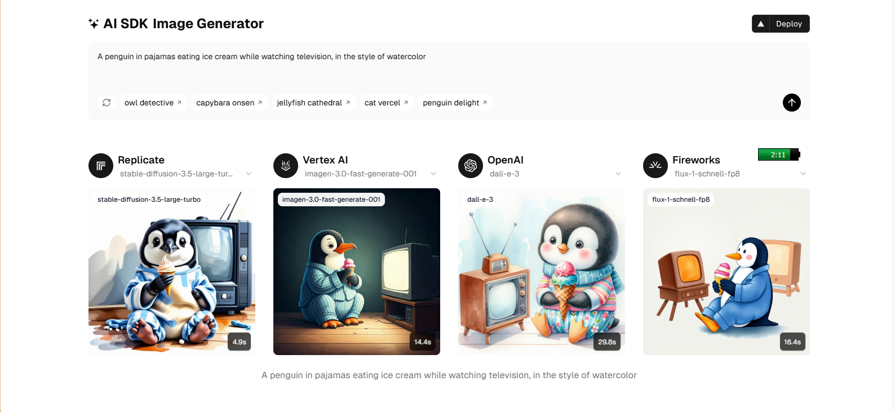
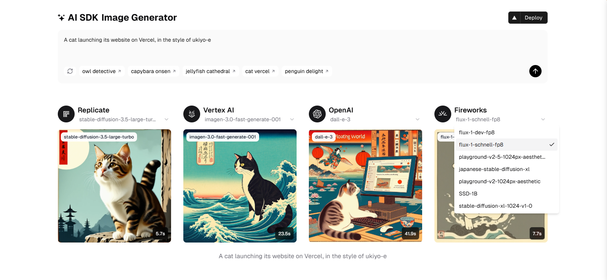
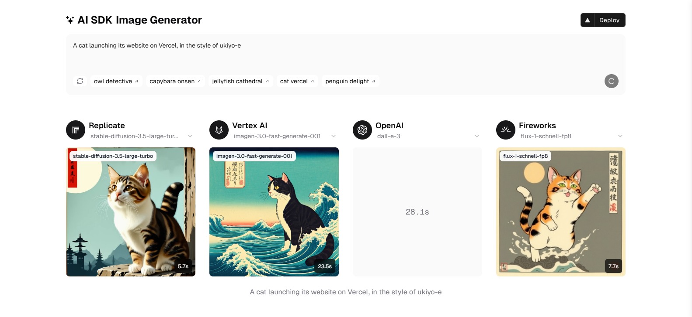

<div align="center">
  
  <h1>AI SDK Image Generator</h1>
  <h3>A Modern AI Image Generation Platform</h3>
</div>

<p align="center">
    <a href="https://ai-sdk-image-generator.vercel.app" target="_blank">
        
    </a>
    <a href="https://github.com/jamalihassan0307/ai-sdk-image-generator" target="_blank">
        
    </a>
</p>

# 📌 Overview

AI SDK Image Generator is a powerful web application that leverages multiple AI providers to generate images from text descriptions. Users can create unique images using different AI models and compare results across providers.

# 🛠️ Tech Stack


## 🔑 Key Features

### AI Model Integration

- Multiple AI providers (Replicate, Vertex AI, OpenAI, Fireworks)
- Simultaneous image generation across providers
- Model selection and customization

### User Interface

- Clean, modern design with shadcn/ui components
- Responsive layout for all devices
- Real-time generation progress indicators

### Image Generation

- Text-to-image generation
- Multiple style options
- Side-by-side provider comparison

## 📸 Screenshots & Workflow

### 1. Main Interface

<div align="center">
  
  <p>The main application interface showing generated penguin images across different AI providers</p>
</div>

### 2. Model Selection & Generation

#### Replicate Models

<div align="center">
  
  <p>Stable Diffusion model options from Replicate</p>
</div>

#### Vertex AI Models

<div align="center">
  
  <p>Imagen model from Google Vertex AI</p>
</div>

#### OpenAI Models

<div align="center">
  
  <p>DALL-E 3 model from OpenAI</p>
</div>

#### Fireworks Models

<div align="center">
  
  <p>Available models from Fireworks including flux-1-schnell-fp8</p>
</div>

### 3. Generated Results Example

<div align="center">
  
  <p>Example of a cat in ukiyo-e style generated across different providers</p>
</div>

### 4. Loading States

<div align="center">
  
  <p>Generation progress indicators for each provider</p>
</div>

### 5. Error Handling

<div align="center">
  
  <p>Error feedback when image generation fails</p>
</div>

## 🚀 Getting Started

1. Clone the repository:

```bash
git clone https://github.com/jamalihassan0307/ai-sdk-image-generator.git
```

2. Install dependencies:

```bash
npm install
```

3. Set up environment variables in `.env.local`:

```env
OPENAI_API_KEY=your_openai_key
REPLICATE_API_TOKEN=your_replicate_token
FIREWORKS_API_KEY=your_fireworks_key
GOOGLE_CLIENT_EMAIL=your_google_email
GOOGLE_PRIVATE_KEY=your_google_key
GOOGLE_VERTEX_PROJECT=your_project_id
GOOGLE_VERTEX_LOCATION=your_location
```

4. Run the development server:

```bash
npm run dev
```

## 👨‍💻 Developer Contact

Feel free to reach out for questions or collaboration:

- GitHub: [@jamalihassan0307](https://github.com/jamalihassan0307)
- LinkedIn: [Jamali Hassan](https://www.linkedin.com/in/jamalihassan0307/)

## 🙏 Acknowledgments

Special thanks to:

- Vercel team for the AI SDK
- All AI provider partners (Replicate, OpenAI, Google, Fireworks)
- The open-source community
